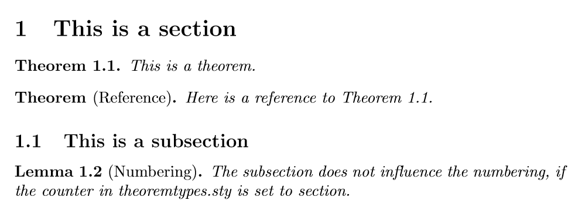

# theoremtypes.sty
A small LaTeX package improving upon the theorem environments of the package [`amsthm`](https://www.ctan.org/pkg/amsthm).
## Features
- Provides theorem environments referencable by number to use in lecture notes
- Provides a single command for defining multiple variations of the same theorem environment at once
## Syntax
- `\NewTheorem{refname}{Title}` defines the environments `refname` and `refname*` with title `Title`.
- `\begin{refname}  ... \end{refname}` for the environment without numbering.
- `\begin{refname*} ... \end{refname*}` for the environment with numbering.
- An optional argument `\begin{refname}[Optional]` which will appear in parantheses after the number.
## Example

```latex
\documentclass{article}
\usepackage{theoremtypes}

\begin{document}
    \section{This is a section}
        \begin{theorem}
            This is a theorem.
        \end{theorem}
        \begin{theorem*}[Reference]
            Here is a reference to  Theorem \ref{1.1}.
        \end{theorem*}
    \subsection{This is a subsection}
        \begin{lemma}[Numbering]
            The subsection does not influence the numbering, if the counter in theoremtypes.sty is set to section.
        \end{lemma}
\end{document}
```
